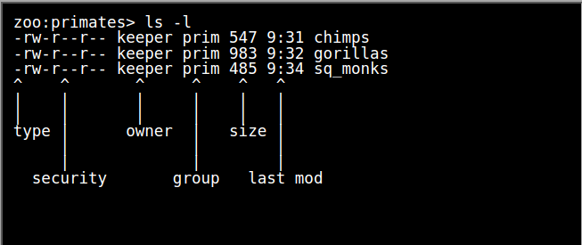

[linuxsurvival](https://linuxsurvival.com/linux-tutorial-introduction/)

## Module 1

## cd

change directory

### more

The "more" command is used to view the contents of a file. 

> more filename

### mkdir

create a directory

> mkdir directory

### mv

move file and directory

"moving" a file from one name to another **rename**

> mv oldname newname

### pwd

print working directory

----------

## Module 2

### cp

copy file: the copy command is "cp" and it has the same syntax as the "mv" command.

> cp filename directory/

> cp filename directory/newname

### rm

remove file

> rm pathname/filename

### rmdir

remove empty directory

> rmdir directory

### security

### chmod

change mode

The first argument you give to the "chmod" command is 'u', 'g', 'o', or a combination of them which specifies which of the three "rwx" sets you want to modify.

> chmod o+w

> chmod ugo-rwx

### groups

see which groups you're in